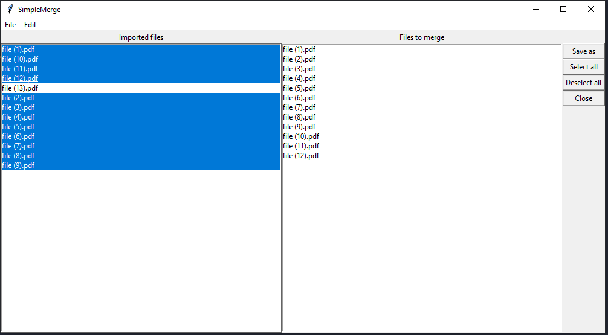

# SimpleMerge

This is a simple tool to merge pdf files into one.

## Usage

1. Run this tool via: `python main.py`
2. Click on "File"
3. Click on "Add files"
4. Select all PDF files you want to merge. 
5. Your PDF files will appear in the "Imported files" list
6. Simply click on one of the files and it will be moved to the "Files to merge" section
7. The order in which you add the files to the "Files to merge" section will determine the order in what the pdf file will be merged
8. Click on "Save as" and give the new PDF file a name and save if to a desired location

### Select all
This function selects all the files in the "Imported files" section. 

### Deselect all
This function removes all the files from the "File to merge" section. 